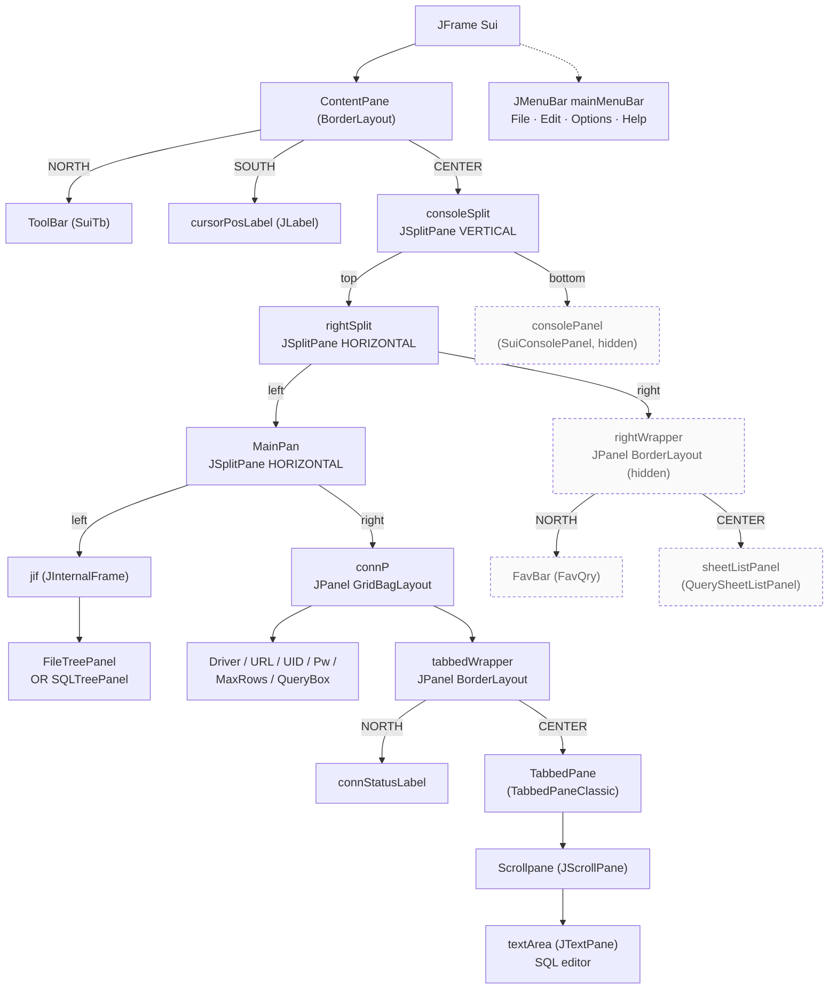

# Main Query Window — Swing Layer Map

This document describes the Swing component hierarchy of Sui's main application window (the one created on startup by [src/Sui.java](../src/Sui.java)). Line references are given for every container so they can be located quickly. The result window opened by SELECT queries is documented separately in [QueryRepWindow.md](QueryRepWindow.md).

---

## 1. Top-level frame

`public class Sui extends JFrame implements ActionListener, ReplListener` — [src/Sui.java#L35](../src/Sui.java#L35)

The frame's content pane uses a plain `BorderLayout`. Three regions are populated:

| BorderLayout slot | Component | Source |
|---|---|---|
| `NORTH` | `ToolBar` (custom `SuiTb`) | [#L523](../src/Sui.java#L523) |
| `CENTER` | `consoleSplit` (vertical `JSplitPane`) | [#L598](../src/Sui.java#L598) |
| `SOUTH` | `cursorPosLabel` (`JLabel`, "Ln X, Col Y") | [#L553](../src/Sui.java#L553) |

The menu bar is attached separately via `setJMenuBar(mainMenuBar)` — [#L1382](../src/Sui.java#L1382). Top-level menus added in order: **File**, **Edit**, **Options**, **Help**.

---

## 2. ASCII sketch of the running window

```
┌────────────────────────────────────────────────────────────────────────────┐
│  File   Edit   Options   Help                                  ← JMenuBar  │
├────────────────────────────────────────────────────────────────────────────┤
│  [ ToolBar — SuiTb buttons: connect, run, monitor, … ]        ← NORTH      │
├──────────────┬───────────────────────────────────┬─────────────────────────┤
│              │  Driver  [▼ driverBox          ]  │                         │
│   FileTree   │  URL     [▼ urlBox             ]  │                         │
│      or      │  UID     [   Uid               ]  │   rightWrapper          │
│   SQLTree    │  Pwd     [   Pw                ]  │  ┌───────────────────┐  │
│   (in JIF)   │  MaxRows [   MaxSel            ]  │  │  FavBar (FavQry)  │  │
│              │  Query   [▼ QueryBox           ]  │  ├───────────────────┤  │
│              │  ┌───────────────────────────┐    │  │  sheetListPanel   │  │
│              │  │ connStatusLabel  (NORTH)  │    │  │  (mutually        │  │
│              │  ├───────────────────────────┤    │  │   exclusive       │  │
│              │  │  TabbedPaneClassic        │    │  │   with FavBar)    │  │
│              │  │  ┌─ Tab 1 ─┬─ Tab 2 ─┐    │    │  └───────────────────┘  │
│              │  │  │ JScrollPane         │  │    │                         │
│              │  │  │  └─ textArea        │  │    │                         │
│              │  │  │     (JTextPane)     │  │    │                         │
│              │  │  └─────────────────────┘  │    │                         │
│              │  └───────────────────────────┘    │                         │
│              │              (tabbedWrapper)      │                         │
├──────────────┴───────────────────────────────────┴─────────────────────────┤
│  consolePanel (SuiConsolePanel) — hidden until shown                       │
├────────────────────────────────────────────────────────────────────────────┤
│  Ln 1, Col 1                                                  ← SOUTH      │
└────────────────────────────────────────────────────────────────────────────┘
```

Vertical division between the editor area and the console is the **outer** split (`consoleSplit`). Horizontal divisions inside the editor area are the **inner** splits (`rightSplit` and `MainPan`).

---

## 3. Component tree

```
JFrame  Sui
└── ContentPane                                     BorderLayout
    ├── NORTH  ToolBar (SuiTb)                                            #L523
    ├── SOUTH  cursorPosLabel (JLabel)                                    #L553
    └── CENTER consoleSplit  JSplitPane.VERTICAL_SPLIT  resizeWeight=1.0  #L598
        │
        ├── TOP    rightSplit  JSplitPane.HORIZONTAL_SPLIT  resizeWeight=1.0   #L574
        │   │
        │   ├── LEFT  MainPan  JSplitPane.HORIZONTAL_SPLIT                #L556
        │   │   │
        │   │   ├── LEFT  jif  JInternalFrame                             #L137
        │   │   │   └── FileTreePanel  (or SQLTreePanel — swap in place)  #L418 / #L4266
        │   │   │
        │   │   └── RIGHT connP  JPanel  GridBagLayout                    #L472
        │   │       ├── Driver  : JLabel + driverBox  (JComboBox)
        │   │       ├── URL     : JLabel + urlBox     (JComboBox)
        │   │       ├── UID     : JLabel + Uid        (JTextField)
        │   │       ├── Pw      : JLabel + Pw         (JPasswordField)
        │   │       ├── MaxRows : JLabel + MaxSel     (NumericTextField)
        │   │       ├── Query   : QueryBox            (JComboBox)
        │   │       └── tabbedWrapper  JPanel  BorderLayout  weighty=50
        │   │           ├── NORTH  connStatusLabel  (JLabel)              #L527
        │   │           └── CENTER TabbedPane  (TabbedPaneClassic)        #L483
        │   │               └── per tab: Scrollpane (JScrollPane)         #L477
        │   │                            └── textArea (JTextPane)         #L475
        │   │
        │   └── RIGHT rightWrapper  JPanel  BorderLayout  (hidden by default)
        │       ├── NORTH  FavBar (FavQry)                                #L4048
        │       └── CENTER sheetListPanel (QuerySheetListPanel, lazy)     #L4097
        │       (FavBar and sheetListPanel are mutually exclusive)
        │
        └── BOTTOM consolePanel  (SuiConsolePanel — hidden by default)    #L599
```

### Layout manager per level

| Container | Layout | Reason |
|---|---|---|
| `ContentPane` | `BorderLayout` | Standard frame layout |
| `consoleSplit` | `JSplitPane` vertical | Editor area on top, console below |
| `rightSplit` | `JSplitPane` horizontal | Main editor on the left, optional side panel on the right |
| `MainPan` | `JSplitPane` horizontal | Tree on the left, connection+editor on the right |
| `connP` | `GridBagLayout` | Rigidly positioned connection field rows; the `tabbedWrapper` row has `weighty=50` so it absorbs all surplus vertical space |
| `tabbedWrapper` | `BorderLayout` | Stack `connStatusLabel` on top of the editor `TabbedPane` |
| `rightWrapper` | `BorderLayout` | Stack `FavBar` on top of `sheetListPanel` (they swap, not coexist) |

---

## 4. Mermaid diagram



Dashed nodes are hidden on first launch and revealed on demand (console toggle, Favourites Show, Sheet List Show).

---

## 5. Popup menus

Right-click handlers attached to leaf components:

| Component | Popup class | Source |
|---|---|---|
| `QueryBox` (the dropdown above the editor) | `ShowQryBox` | [#L491-L496](../src/Sui.java#L491) |
| `textArea` (SQL editor) | `QryPop` | [#L925-L933](../src/Sui.java#L925) |
| `Scrollpane` viewport (empty area below text) | `QryPop` (same as editor) | [#L937-L945](../src/Sui.java#L937) |
| `connStatusLabel` | Inline connection-history popup (4 most recent) | [#L535-L545](../src/Sui.java#L535) |
| `FavBar` | `FavPopRing` | [#L4054-L4057](../src/Sui.java#L4054) |

---

## 6. Split-pane behaviour worth knowing

- **Resize weight = 1.0** on both outer splits ([#L575](../src/Sui.java#L575), [#L601](../src/Sui.java#L601)) — when the frame is resized, all extra space goes to the main editor area, not to the right panel or the console.
- **Custom divider one-touch buttons** are centred via a custom divider UI ([#L4313-L4338](../src/Sui.java#L4313)).
- **Minimum-size guards** via `PropertyChangeListener` ([#L561-L588](../src/Sui.java#L561)) prevent the user from accidentally collapsing the main editor under the tree or the right panel.
- **Hidden-divider trick** — when `rightWrapper` is invisible the `rightSplit` divider size is set to 0 so no empty gutter is shown. Same trick for `consoleSplit` ↔ `consolePanel`.
- **JInternalFrame as tree host** — the tree is wrapped in a `JInternalFrame` so `FileTreePanel` and `SQLTreePanel` can be swapped inside it without re-attaching to the split pane.
- **`tabbedWrapper` row weight = 50** in `connP`'s GridBag ([#L4399-L4400](../src/Sui.java#L4399)) — connection field rows never compress; all vertical change is absorbed by the editor.
- **`FavBar` and `sheetListPanel` are mutually exclusive** — only one of the two right-side panels is visible at a time ([#L4043](../src/Sui.java#L4043), [#L4093](../src/Sui.java#L4093)).

---

## 7. Field declarations — quick reference

| Field | Declared | Created |
|---|---|---|
| `mainMenuBar` (`JMenuBar`) | — | [#L396](../src/Sui.java#L396) |
| `ToolBar` (`SuiTb`) | [#L151](../src/Sui.java#L151) | [#L415](../src/Sui.java#L415) |
| `cursorPosLabel` (`JLabel`) | [#L97](../src/Sui.java#L97) | [#L530](../src/Sui.java#L530) |
| `jif` (`JInternalFrame`) | [#L137](../src/Sui.java#L137) | static init |
| `FileTree` (`FileTreePanel`) | [#L148](../src/Sui.java#L148) | [#L418](../src/Sui.java#L418) |
| `SQLTree` (`SQLTreePanel`) | [#L149](../src/Sui.java#L149) | lazy [#L4266](../src/Sui.java#L4266) |
| `connP` (`JPanel`) | [#L103](../src/Sui.java#L103) | [#L472](../src/Sui.java#L472) |
| `QueryBox` (`JComboBox`) | [#L131](../src/Sui.java#L131) | in `getConnP()` |
| `textArea` (`JTextPane`) | [#L128](../src/Sui.java#L128) | [#L475](../src/Sui.java#L475) |
| `Scrollpane` (`JScrollPane`) | [#L129](../src/Sui.java#L129) | [#L477](../src/Sui.java#L477) |
| `TabbedPane` (`TabbedPaneClassic`) | [#L136](../src/Sui.java#L136) | [#L483](../src/Sui.java#L483) |
| `tabbedWrapper` (`JPanel`) | inside `getConnP()` | inside `getConnP()` |
| `connStatusLabel` (`JLabel`) | — | [#L527](../src/Sui.java#L527) |
| `MainPan` (`JSplitPane`) | [#L135](../src/Sui.java#L135) | [#L556](../src/Sui.java#L556) |
| `rightWrapper` (`JPanel`) | [#L144](../src/Sui.java#L144) | field init |
| `FavBar` (`FavQry`) | [#L155](../src/Sui.java#L155) | [#L416](../src/Sui.java#L416) |
| `sheetListPanel` (`QuerySheetListPanel`) | [#L157](../src/Sui.java#L157) | lazy [#L4097](../src/Sui.java#L4097) |
| `rightSplit` (`JSplitPane`) | [#L145](../src/Sui.java#L145) | [#L574](../src/Sui.java#L574) |
| `consolePanel` (`SuiConsolePanel`) | [#L146](../src/Sui.java#L146) | [#L599](../src/Sui.java#L599) |
| `consoleSplit` (`JSplitPane`) | [#L147](../src/Sui.java#L147) | [#L598](../src/Sui.java#L598) |

---

## 8. Related documents

- [QueryRepWindow.md](QueryRepWindow.md) — the SELECT result window opened from this main window
- [hierarchy-Sui.md](hierarchy-Sui.md) — class hierarchy of the `Sui` class
- [ConnManager.md](ConnManager.md) — the connection list shown in the connection dialog
